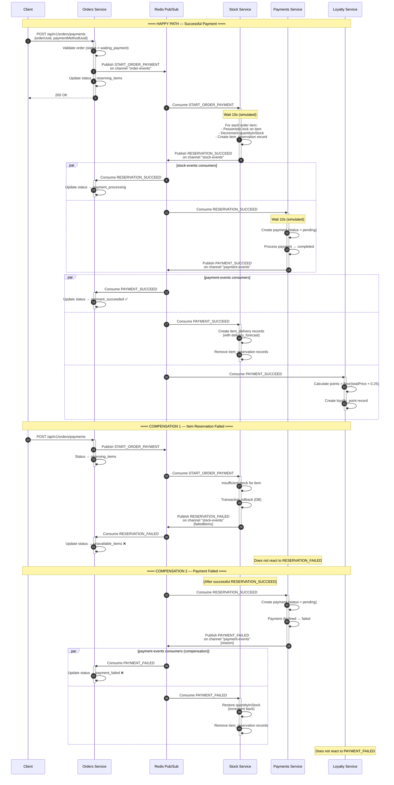
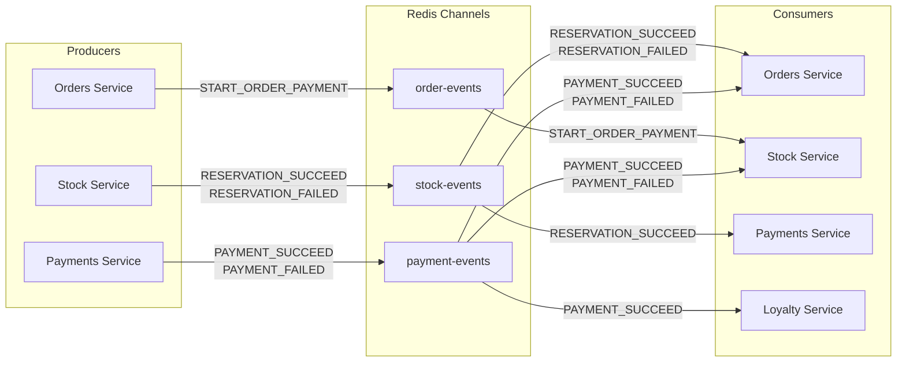
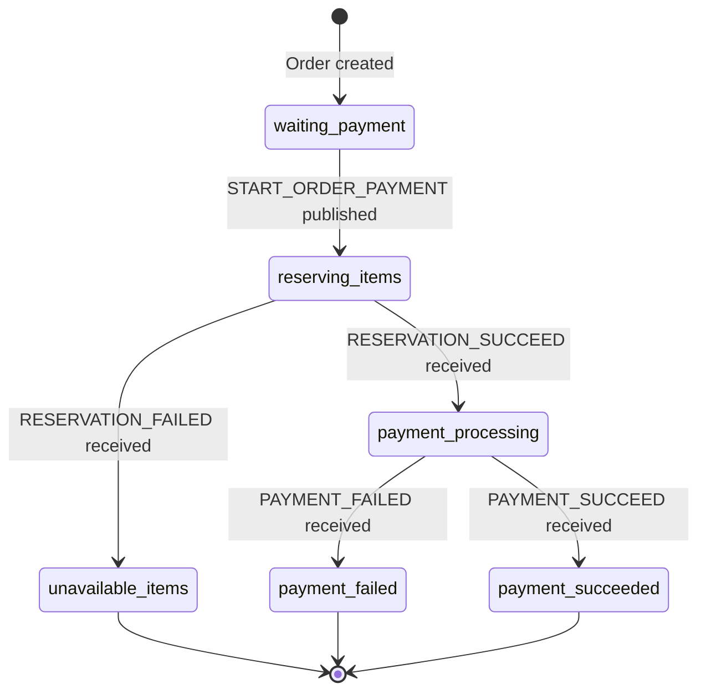

# Choreographed Saga — Event Flow

## Overview

This project implements the **Choreographed Saga** pattern for processing order payments in a microservices architecture. Each service reacts to events published by other services via **Redis Pub/Sub**, without the presence of a central orchestrator.

### Services

| Service              | Port | Responsibility                     |
| -------------------- | ---- | ---------------------------------- |
| **orders-service**   | 3000 | Manages orders and coordinates status |
| **stock-service**    | 3001 | Stock reservation and inventory control |
| **payments-service** | 3002 | Payment processing                 |
| **loyalty-service**  | 3003 | Loyalty points program             |

### Redis Pub/Sub Channels

| Channel          | Producer         | Consumers                                      |
| ---------------- | ---------------- | ---------------------------------------------- |
| `order-events`   | orders-service   | stock-service                                  |
| `stock-events`   | stock-service    | orders-service, payments-service               |
| `payment-events` | payments-service | orders-service, stock-service, loyalty-service |

### Event Types

| Event                 | Channel        | Description                    |
| --------------------- | -------------- | ------------------------------ |
| `START_ORDER_PAYMENT` | order-events   | Payment flow start             |
| `RESERVATION_SUCCEED` | stock-events   | Items reserved successfully    |
| `RESERVATION_FAILED`  | stock-events   | Item reservation failed        |
| `PAYMENT_SUCCEED`     | payment-events | Payment approved               |
| `PAYMENT_FAILED`      | payment-events | Payment declined               |

---

## Diagram — Full Flow (Happy Path + Compensations)

---

## Diagram — Publish and Subscribe Matrix

---

## Diagram — Order Status Lifecycle

---

## Detailed Step-by-Step Flow

### 1. Start — Client Requests Payment

The client sends a `POST /api/v1/orders/payments` request with `orderUuid` and `paymentMethodUuid`. The **orders-service** validates that the order exists and has status `waiting_payment`, publishes the `START_ORDER_PAYMENT` event on the `order-events` channel, and updates the order status to `reserving_items`.

### 2. Item Reservation

The **stock-service** consumes the `START_ORDER_PAYMENT` event. For each order item, within a transaction with a pessimistic lock:

- Checks if there is sufficient stock (`quantityInStock >= requested quantity`)
- Decrements `quantityInStock`
- Creates an `item_reservation` record

**Success:** Publishes `RESERVATION_SUCCEED` on the `stock-events` channel.  
**Failure:** Rolls back the entire transaction and publishes `RESERVATION_FAILED` with the list of unavailable items.

### 3. Payment Processing

The **payments-service** consumes `RESERVATION_SUCCEED` from the `stock-events` channel. Creates a payment record with status `pending` and processes the payment:

- Checks for duplicates (same `userUuid` + `orderUuid` + `paymentMethodUuid`)
- If `paymentMethodUuid` is the failure test UUID (`ff1a8411-b443-408f-8012-fa62eb9067bd`), marks it as `failed`
- Otherwise, marks it as `completed`

**Success:** Publishes `PAYMENT_SUCCEED` on the `payment-events` channel.  
**Failure:** Publishes `PAYMENT_FAILED` with the reason.

### 4. Finalization — Reactions to Payment Result

#### Successful Payment (`PAYMENT_SUCCEED`)

| Service             | Action                                                                                       |
| ------------------- | -------------------------------------------------------------------------------------------- |
| **orders-service**  | Updates order status → `payment_succeeded`                                                   |
| **stock-service**   | Creates `item_delivery` records with delivery forecast and removes `item_reservation` records |
| **loyalty-service** | Calculates loyalty points (`floor(totalPrice × 0.25)`) and creates `loyalty_point` record    |

#### Failed Payment (`PAYMENT_FAILED`)

| Service             | Action (Compensation)                                          |
| ------------------- | -------------------------------------------------------------- |
| **orders-service**  | Updates order status → `payment_failed`                        |
| **stock-service**   | Restores `quantityInStock` and removes `item_reservation` records |
| **loyalty-service** | No action                                                      |

---

## Infrastructure

- **Message Broker:** Redis 7 (Pub/Sub via `ioredis`)
- **Database:** PostgreSQL 17 (one database per service)
- **Framework:** NestJS with TypeORM
- **Containerization:** Docker Compose
