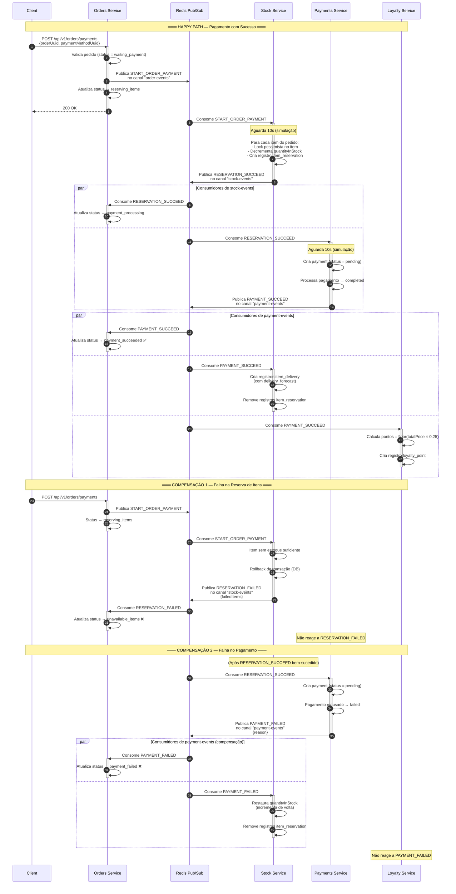
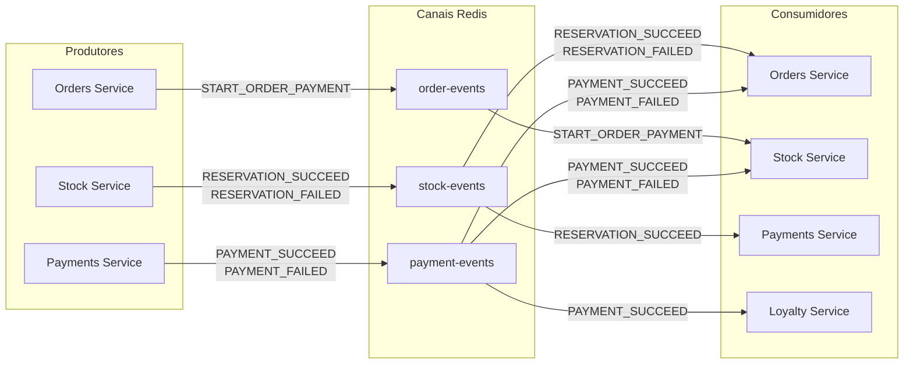

# Choreographed Saga — Fluxo de Eventos

## Visão Geral

Este projeto implementa o padrão **Saga Coreografada** para processar pagamentos de pedidos em uma arquitetura de microsserviços. Cada serviço reage a eventos publicados por outros serviços via **Redis Pub/Sub**, sem a presença de um orquestrador central.

### Serviços

| Serviço              | Porta | Responsabilidade                   |
| -------------------- | ----- | ---------------------------------- |
| **orders-service**   | 3000  | Gerencia pedidos e coordena status |
| **stock-service**    | 3001  | Reserva e controle de estoque      |
| **payments-service** | 3002  | Processamento de pagamentos        |
| **loyalty-service**  | 3003  | Programa de pontos de fidelidade   |

### Canais Redis Pub/Sub

| Canal            | Produtor         | Consumidores                                   |
| ---------------- | ---------------- | ---------------------------------------------- |
| `order-events`   | orders-service   | stock-service                                  |
| `stock-events`   | stock-service    | orders-service, payments-service               |
| `payment-events` | payments-service | orders-service, stock-service, loyalty-service |

### Tipos de Eventos

| Evento                | Canal          | Descrição                    |
| --------------------- | -------------- | ---------------------------- |
| `START_ORDER_PAYMENT` | order-events   | Início do fluxo de pagamento |
| `RESERVATION_SUCCEED` | stock-events   | Itens reservados com sucesso |
| `RESERVATION_FAILED`  | stock-events   | Falha na reserva de itens    |
| `PAYMENT_SUCCEED`     | payment-events | Pagamento aprovado           |
| `PAYMENT_FAILED`      | payment-events | Pagamento recusado           |

---

## Diagrama — Fluxo Completo (Happy Path + Compensações)

---

## Diagrama — Matriz de Publicação e Assinatura

---

## Diagrama — Ciclo de Vida do Status do Pedido

---

## Fluxo Detalhado Passo a Passo

### 1. Início — Cliente Solicita Pagamento

O cliente faz uma requisição `POST /api/v1/orders/payments` com `orderUuid` e `paymentMethodUuid`. O **orders-service** valida que o pedido existe e tem status `waiting_payment`, publica o evento `START_ORDER_PAYMENT` no canal `order-events` e atualiza o status do pedido para `reserving_items`.

### 2. Reserva de Itens

O **stock-service** consome o evento `START_ORDER_PAYMENT`. Para cada item do pedido, dentro de uma transação com lock pessimista:

- Verifica se há estoque suficiente (`quantityInStock >= quantidade solicitada`)
- Decrementa `quantityInStock`
- Cria um registro `item_reservation`

**Sucesso:** Publica `RESERVATION_SUCCEED` no canal `stock-events`.  
**Falha:** Faz rollback de toda a transação e publica `RESERVATION_FAILED` com a lista de itens indisponíveis.

### 3. Processamento do Pagamento

O **payments-service** consome `RESERVATION_SUCCEED` do canal `stock-events`. Cria um registro de pagamento com status `pending` e processa o pagamento:

- Verifica duplicidade (mesmo `userUuid` + `orderUuid` + `paymentMethodUuid`)
- Se o `paymentMethodUuid` é o UUID de teste de falha (`ff1a8411-b443-408f-8012-fa62eb9067bd`), marca como `failed`
- Caso contrário, marca como `completed`

**Sucesso:** Publica `PAYMENT_SUCCEED` no canal `payment-events`.  
**Falha:** Publica `PAYMENT_FAILED` com o motivo.

### 4. Finalização — Reações ao Resultado do Pagamento

#### Pagamento com Sucesso (`PAYMENT_SUCCEED`)

| Serviço             | Ação                                                                                      |
| ------------------- | ----------------------------------------------------------------------------------------- |
| **orders-service**  | Atualiza status do pedido → `payment_succeeded`                                           |
| **stock-service**   | Cria registros `item_delivery` com previsão de entrega e remove os `item_reservation`     |
| **loyalty-service** | Calcula pontos de fidelidade (`floor(totalPrice × 0.25)`) e cria registro `loyalty_point` |

#### Pagamento com Falha (`PAYMENT_FAILED`)

| Serviço             | Ação (Compensação)                                        |
| ------------------- | --------------------------------------------------------- |
| **orders-service**  | Atualiza status do pedido → `payment_failed`              |
| **stock-service**   | Restaura `quantityInStock` e remove os `item_reservation` |
| **loyalty-service** | Nenhuma ação                                              |

---

## Infraestrutura

- **Message Broker:** Redis 7 (Pub/Sub via `ioredis`)
- **Banco de Dados:** PostgreSQL 17 (um banco por serviço)
- **Framework:** NestJS com TypeORM
- **Containerização:** Docker Compose
