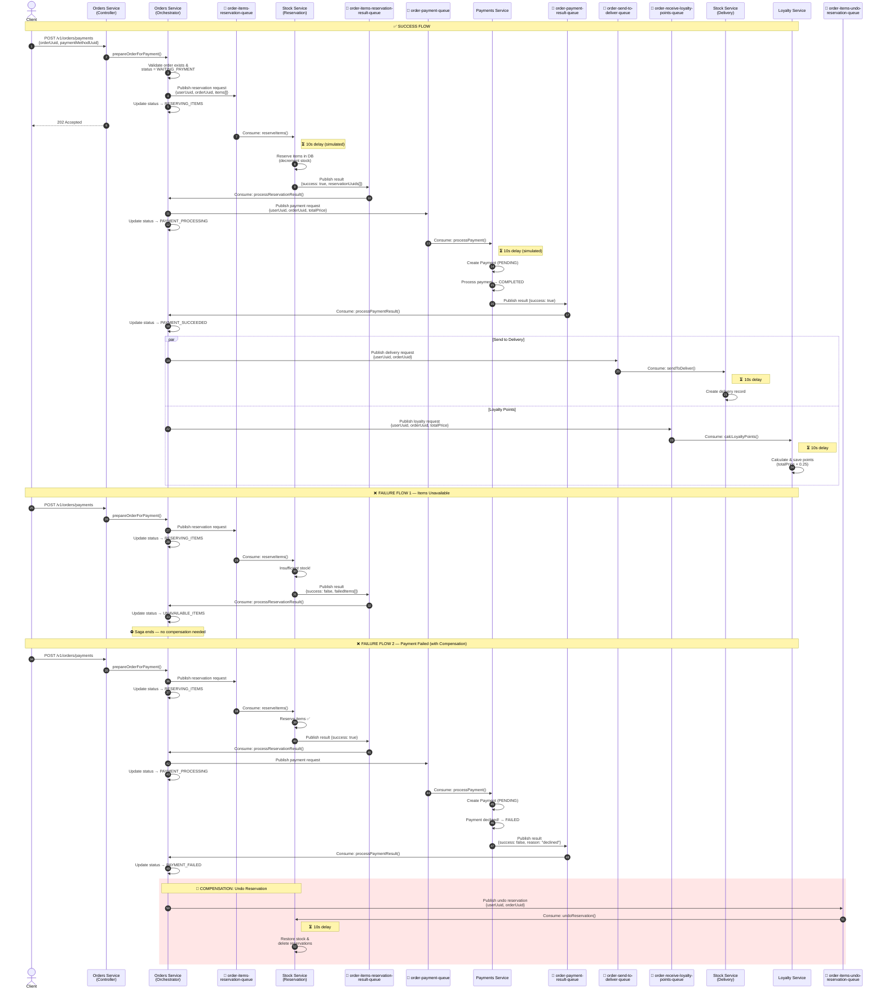
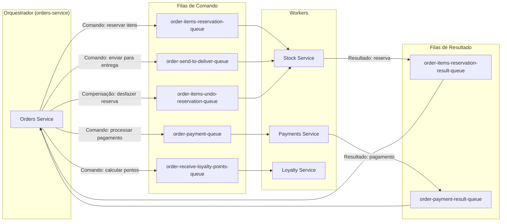
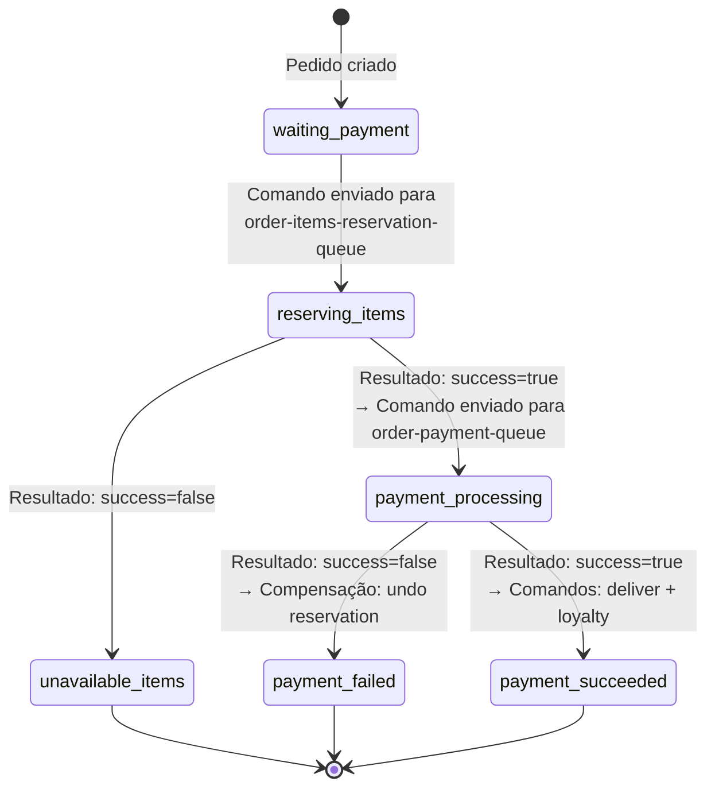
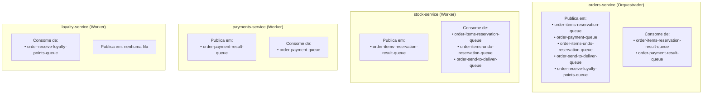

# Orchestrated Saga — Fluxo de Eventos

## Visão Geral

Este projeto implementa o padrão **Saga Orquestrada** para processar pagamentos de pedidos em uma arquitetura de microsserviços. O **orders-service** atua como orquestrador central, controlando todo o fluxo de forma imperativa através de filas de comando e resultado via **BullMQ** (Redis).

### Serviços

| Serviço              | Porta | Papel                                                      |
| -------------------- | ----- | ---------------------------------------------------------- |
| **orders-service**   | 3000  | Orquestrador — gerencia pedidos e controla o fluxo da saga |
| **stock-service**    | 3001  | Worker — reserva de estoque e entregas                     |
| **payments-service** | 3002  | Worker — processamento de pagamentos                       |
| **loyalty-service**  | 3003  | Worker — programa de pontos de fidelidade                  |

### Filas BullMQ

| Fila                                   | Job Name                             | Produtor         | Consumidor       |
| -------------------------------------- | ------------------------------------ | ---------------- | ---------------- |
| `order-items-reservation-queue`        | `order-items-reservation-job`        | orders-service   | stock-service    |
| `order-items-reservation-result-queue` | `order-items-reservation-result-job` | stock-service    | orders-service   |
| `order-payment-queue`                  | `order-payment-job`                  | orders-service   | payments-service |
| `order-payment-result-queue`           | `payment-result-job`                 | payments-service | orders-service   |
| `order-items-undo-reservation-queue`   | `undo-reservation-job`               | orders-service   | stock-service    |
| `order-send-to-deliver-queue`          | `send-to-deliver-job`                | orders-service   | stock-service    |
| `order-receive-loyalty-points-queue`   | `receive-loyalty-points-job`         | orders-service   | loyalty-service  |

### Padrão de Comunicação

Diferentemente da saga coreografada (Redis Pub/Sub), aqui cada interação segue o padrão **Command/Reply**:

- O orquestrador envia um **comando** para uma fila de destino
- O worker processa e envia o **resultado** de volta para uma fila de resposta
- O orquestrador decide o próximo passo com base no resultado

---

## Diagrama — Fluxo Completo (Happy Path + Compensações)

---

## Diagrama — Arquitetura de Filas (Command/Reply)

---

## Diagrama — Ciclo de Vida do Status do Pedido

---

## Diagrama — Matriz Produtor/Consumidor por Serviço

---

## Fluxo Detalhado Passo a Passo

### 1. Início — Cliente Solicita Pagamento

O cliente faz uma requisição `POST /v1/orders/payments` com `orderUuid` e `paymentMethodUuid`. O **orders-service** (orquestrador) valida que o pedido existe e tem status `waiting_payment`, envia um comando de reserva para a fila `order-items-reservation-queue` e atualiza o status do pedido para `reserving_items`.

### 2. Reserva de Itens (Stock Service)

O **stock-service** consome o job `order-items-reservation-job`. Para cada item do pedido, dentro de uma transação com lock pessimista:

- Verifica se há estoque suficiente (`quantityInStock >= quantidade solicitada`)
- Decrementa `quantityInStock`
- Cria um registro `item_reservation`

**Sucesso:** Publica `order-items-reservation-result-job` na fila de resultado com `success: true` e `reservationUuids[]`.
**Falha:** Faz rollback de toda a transação e publica resultado com `success: false` e `failedItems[]`.

### 3. Orquestrador Processa Resultado da Reserva

O **orders-service** consome o resultado da fila `order-items-reservation-result-queue`:

- **`success: true`** → Envia comando de pagamento para `order-payment-queue` com `totalPrice` e atualiza status para `payment_processing`
- **`success: false`** → Atualiza status para `unavailable_items` e a saga termina (sem necessidade de compensação)

### 4. Processamento do Pagamento (Payments Service)

O **payments-service** consome o job `order-payment-job`. Cria um registro de pagamento com status `pending` e processa:

- Verifica duplicidade (mesmo `userUuid` + `orderUuid` + `paymentMethodUuid`)
- Se o `paymentMethodUuid` é o UUID de teste de falha (`ff1a8411-b443-408f-8012-fa62eb9067bd`), marca como `failed`
- Caso contrário, marca como `completed`

**Sucesso:** Publica `payment-result-job` na fila de resultado com `success: true`.
**Falha:** Publica resultado com `success: false` e `reason`.

### 5. Orquestrador Processa Resultado do Pagamento

O **orders-service** consome o resultado da fila `order-payment-result-queue`:

#### Pagamento com Sucesso (`success: true`)

O orquestrador atualiza status para `payment_succeeded` e dispara dois comandos em paralelo:

| Fila                                 | Serviço Destino | Ação                                                                               |
| ------------------------------------ | --------------- | ---------------------------------------------------------------------------------- |
| `order-send-to-deliver-queue`        | stock-service   | Cria registros `item_delivery` com previsão de entrega e remove `item_reservation` |
| `order-receive-loyalty-points-queue` | loyalty-service | Calcula pontos `floor(totalPrice × 0.25)` e cria registro `loyalty_point`          |

#### Pagamento com Falha (`success: false`)

O orquestrador atualiza status para `payment_failed` e dispara a **compensação**:

| Fila                                 | Serviço Destino | Ação (Compensação)                                     |
| ------------------------------------ | --------------- | ------------------------------------------------------ |
| `order-items-undo-reservation-queue` | stock-service   | Restaura `quantityInStock` e remove `item_reservation` |

---

## Comparação: Saga Orquestrada vs Saga Coreografada

| Aspecto                   | Orquestrada (este projeto)                    | Coreografada                                            |
| ------------------------- | --------------------------------------------- | ------------------------------------------------------- |
| **Controle de fluxo**     | Centralizado no orders-service                | Distribuído entre todos os serviços                     |
| **Message broker**        | BullMQ (filas Redis)                          | Redis Pub/Sub (canais)                                  |
| **Padrão de comunicação** | Command/Reply (request-response)              | Publish/Subscribe (eventos)                             |
| **Compensação**           | Orquestrador envia comando explícito de undo  | Serviços reagem independentemente a eventos de falha    |
| **Acoplamento**           | Workers não conhecem uns aos outros           | Serviços precisam conhecer os eventos de outros         |
| **Visibilidade do fluxo** | Fluxo completo em um só lugar (order.service) | Fluxo distribuído entre os consumidores de cada serviço |
| **Escalabilidade**        | Orquestrador pode ser gargalo                 | Sem ponto central de controle                           |

---

## Infraestrutura

- **Message Broker:** Redis 8 (BullMQ — filas com workers)
- **Banco de Dados:** PostgreSQL 17 (um banco por serviço)
- **Framework:** NestJS com TypeORM + `@nestjs/bullmq`
- **Containerização:** Docker Compose
