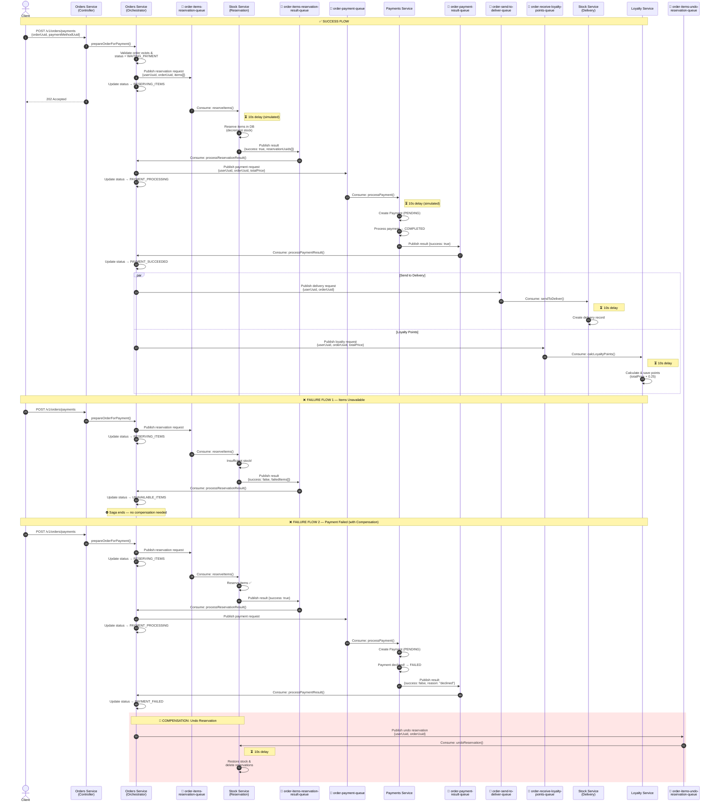

# Orchestrated Saga - Order Payment Flow

```mermaid
sequenceDiagram
    autonumber
    actor Client
    participant OC as Orders Service<br/>(Controller)
    participant OS as Orders Service<br/>(Orchestrator)
    participant Q1 as 📨 order-items-<br/>reservation-queue
    participant SS as Stock Service<br/>(Reservation)
    participant Q2 as 📨 order-items-reservation-<br/>result-queue
    participant Q3 as 📨 order-payment-queue
    participant PS as Payments Service
    participant Q4 as 📨 order-payment-<br/>result-queue
    participant Q5 as 📨 order-send-to-<br/>deliver-queue
    participant Q6 as 📨 order-receive-loyalty-<br/>points-queue
    participant SD as Stock Service<br/>(Delivery)
    participant LS as Loyalty Service
    participant Q7 as 📨 order-items-undo-<br/>reservation-queue

    Note over Client,LS: ✅ SUCCESS FLOW

    Client->>OC: POST /v1/orders/payments<br/>{orderUuid, paymentMethodUuid}
    OC->>OS: prepareOrderForPayment()
    OS->>OS: Validate order exists &<br/>status = WAITING_PAYMENT
    OS->>Q1: Publish reservation request<br/>{userUuid, orderUuid, items[]}
    OS->>OS: Update status → RESERVING_ITEMS
    OC-->>Client: 202 Accepted

    Q1->>SS: Consume: reserveItems()
    Note right of SS: ⏳ 10s delay (simulated)
    SS->>SS: Reserve items in DB<br/>(decrement stock)
    SS->>Q2: Publish result<br/>{success: true, reservationUuids[]}

    Q2->>OS: Consume: processReservationResult()
    OS->>Q3: Publish payment request<br/>{userUuid, orderUuid, totalPrice}
    OS->>OS: Update status → PAYMENT_PROCESSING

    Q3->>PS: Consume: processPayment()
    Note right of PS: ⏳ 10s delay (simulated)
    PS->>PS: Create Payment (PENDING)
    PS->>PS: Process payment → COMPLETED
    PS->>Q4: Publish result {success: true}

    Q4->>OS: Consume: processPaymentResult()
    OS->>OS: Update status → PAYMENT_SUCCEEDED

    par Send to Delivery
        OS->>Q5: Publish delivery request<br/>{userUuid, orderUuid}
        Q5->>SD: Consume: sendToDeliver()
        Note right of SD: ⏳ 10s delay
        SD->>SD: Create delivery record
    and Loyalty Points
        OS->>Q6: Publish loyalty request<br/>{userUuid, orderUuid, totalPrice}
        Q6->>LS: Consume: calcLoyaltyPoints()
        Note right of LS: ⏳ 10s delay
        LS->>LS: Calculate & save points<br/>(totalPrice × 0.25)
    end

    Note over Client,LS: ❌ FAILURE FLOW 1 — Items Unavailable

    Client->>OC: POST /v1/orders/payments
    OC->>OS: prepareOrderForPayment()
    OS->>Q1: Publish reservation request
    OS->>OS: Update status → RESERVING_ITEMS

    Q1->>SS: Consume: reserveItems()
    SS->>SS: Insufficient stock!
    SS->>Q2: Publish result<br/>{success: false, failedItems[]}

    Q2->>OS: Consume: processReservationResult()
    OS->>OS: Update status → UNAVAILABLE_ITEMS
    Note over OS: ⛔ Saga ends — no compensation needed

    Note over Client,LS: ❌ FAILURE FLOW 2 — Payment Failed (with Compensation)

    Client->>OC: POST /v1/orders/payments
    OC->>OS: prepareOrderForPayment()
    OS->>Q1: Publish reservation request
    OS->>OS: Update status → RESERVING_ITEMS

    Q1->>SS: Consume: reserveItems()
    SS->>SS: Reserve items ✅
    SS->>Q2: Publish result {success: true}

    Q2->>OS: Consume: processReservationResult()
    OS->>Q3: Publish payment request
    OS->>OS: Update status → PAYMENT_PROCESSING

    Q3->>PS: Consume: processPayment()
    PS->>PS: Create Payment (PENDING)
    PS->>PS: Payment declined! → FAILED
    PS->>Q4: Publish result<br/>{success: false, reason: "declined"}

    Q4->>OS: Consume: processPaymentResult()
    OS->>OS: Update status → PAYMENT_FAILED

    rect rgb(255, 230, 230)
        Note over OS,SS: 🔄 COMPENSATION: Undo Reservation
        OS->>Q7: Publish undo reservation<br/>{userUuid, orderUuid}
        Q7->>SS: Consume: undoReservation()
        Note right of SS: ⏳ 10s delay
        SS->>SS: Restore stock &<br/>delete reservations
    end
```
