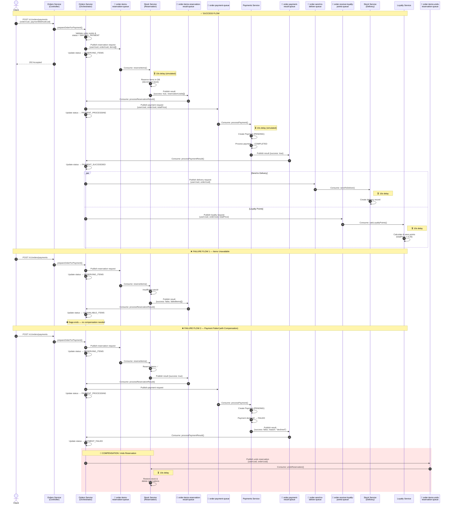
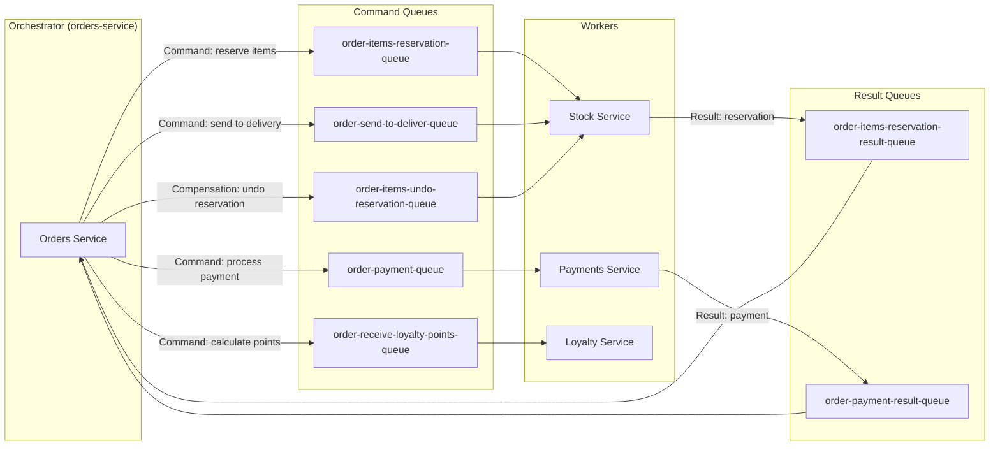
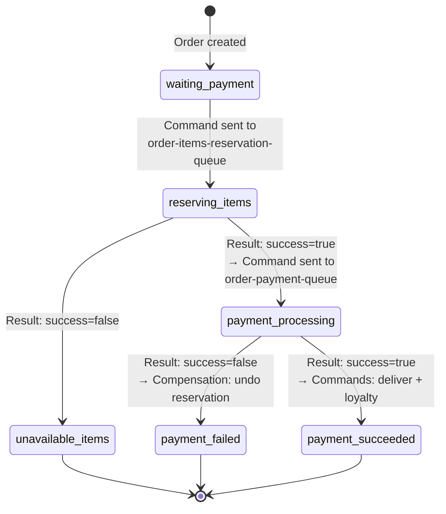
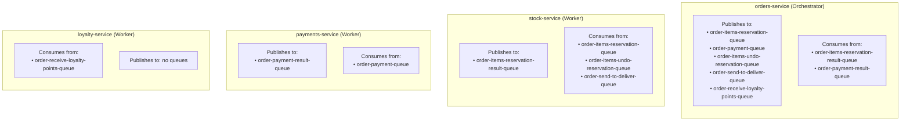

# Orchestrated Saga — Event Flow

## Overview

This project implements the **Orchestrated Saga** pattern for processing order payments in a microservices architecture. The **orders-service** acts as a central orchestrator, controlling the entire flow imperatively through command and result queues via **BullMQ** (Redis).

### Services

| Service              | Port | Role                                                         |
| -------------------- | ---- | ------------------------------------------------------------ |
| **orders-service**   | 3000 | Orchestrator — manages orders and controls the saga flow     |
| **stock-service**    | 3001 | Worker — stock reservation and deliveries                    |
| **payments-service** | 3002 | Worker — payment processing                                  |
| **loyalty-service**  | 3003 | Worker — loyalty points program                              |

### BullMQ Queues

| Queue                                  | Job Name                             | Producer         | Consumer         |
| -------------------------------------- | ------------------------------------ | ---------------- | ---------------- |
| `order-items-reservation-queue`        | `order-items-reservation-job`        | orders-service   | stock-service    |
| `order-items-reservation-result-queue` | `order-items-reservation-result-job` | stock-service    | orders-service   |
| `order-payment-queue`                  | `order-payment-job`                  | orders-service   | payments-service |
| `order-payment-result-queue`           | `payment-result-job`                 | payments-service | orders-service   |
| `order-items-undo-reservation-queue`   | `undo-reservation-job`               | orders-service   | stock-service    |
| `order-send-to-deliver-queue`          | `send-to-deliver-job`                | orders-service   | stock-service    |
| `order-receive-loyalty-points-queue`   | `receive-loyalty-points-job`         | orders-service   | loyalty-service  |

### Communication Pattern

Unlike the choreographed saga (Redis Pub/Sub), here each interaction follows the **Command/Reply** pattern:

- The orchestrator sends a **command** to a destination queue
- The worker processes it and sends the **result** back to a reply queue
- The orchestrator decides the next step based on the result

---

## Diagram — Full Flow (Happy Path + Compensations)

---

## Diagram — Queue Architecture (Command/Reply)

---

## Diagram — Order Status Lifecycle

---

## Diagram — Producer/Consumer Matrix by Service

---

## Detailed Step-by-Step Flow

### 1. Start — Client Requests Payment

The client sends a `POST /v1/orders/payments` request with `orderUuid` and `paymentMethodUuid`. The **orders-service** (orchestrator) validates that the order exists and has status `waiting_payment`, sends a reservation command to the `order-items-reservation-queue` queue, and updates the order status to `reserving_items`.

### 2. Item Reservation (Stock Service)

The **stock-service** consumes the `order-items-reservation-job` job. For each order item, within a transaction with a pessimistic lock:

- Checks if there is sufficient stock (`quantityInStock >= requested quantity`)
- Decrements `quantityInStock`
- Creates an `item_reservation` record

**Success:** Publishes `order-items-reservation-result-job` to the result queue with `success: true` and `reservationUuids[]`.
**Failure:** Rolls back the entire transaction and publishes result with `success: false` and `failedItems[]`.

### 3. Orchestrator Processes Reservation Result

The **orders-service** consumes the result from the `order-items-reservation-result-queue` queue:

- **`success: true`** → Sends payment command to `order-payment-queue` with `totalPrice` and updates status to `payment_processing`
- **`success: false`** → Updates status to `unavailable_items` and the saga ends (no compensation needed)

### 4. Payment Processing (Payments Service)

The **payments-service** consumes the `order-payment-job` job. Creates a payment record with status `pending` and processes it:

- Checks for duplicates (same `userUuid` + `orderUuid` + `paymentMethodUuid`)
- If `paymentMethodUuid` is the failure test UUID (`ff1a8411-b443-408f-8012-fa62eb9067bd`), marks it as `failed`
- Otherwise, marks it as `completed`

**Success:** Publishes `payment-result-job` to the result queue with `success: true`.
**Failure:** Publishes result with `success: false` and `reason`.

### 5. Orchestrator Processes Payment Result

The **orders-service** consumes the result from the `order-payment-result-queue` queue:

#### Successful Payment (`success: true`)

The orchestrator updates status to `payment_succeeded` and dispatches two commands in parallel:

| Queue                                | Target Service  | Action                                                                              |
| ------------------------------------ | --------------- | ----------------------------------------------------------------------------------- |
| `order-send-to-deliver-queue`        | stock-service   | Creates `item_delivery` records with delivery forecast and removes `item_reservation` |
| `order-receive-loyalty-points-queue` | loyalty-service | Calculates points `floor(totalPrice × 0.25)` and creates `loyalty_point` record     |

#### Failed Payment (`success: false`)

The orchestrator updates status to `payment_failed` and dispatches the **compensation**:

| Queue                                | Target Service  | Action (Compensation)                                       |
| ------------------------------------ | --------------- | ----------------------------------------------------------- |
| `order-items-undo-reservation-queue` | stock-service   | Restores `quantityInStock` and removes `item_reservation`   |

---

## Comparação: Saga Orquestrada vs Saga Coreografada

| Aspecto                   | Orquestrada (este projeto)                    | Coreografada                                            |
| ------------------------- | --------------------------------------------- | ------------------------------------------------------- |
| **Controle de fluxo**     | Centralizado no orders-service                | Distribuído entre todos os serviços                     |
| **Message broker**        | BullMQ (filas Redis)                          | Redis Pub/Sub (canais)                                  |
| **Padrão de comunicação** | Command/Reply (request-response)              | Publish/Subscribe (eventos)                             |
| **Compensação**           | Orquestrador envia comando explícito de undo  | Serviços reagem independentemente a eventos de falha    |
| **Acoplamento**           | Workers não conhecem uns aos outros           | Serviços precisam conhecer os eventos de outros         |
| **Visibilidade do fluxo** | Fluxo completo em um só lugar (order.service) | Fluxo distribuído entre os consumidores de cada serviço |
| **Escalabilidade**        | Orquestrador pode ser gargalo                 | Sem ponto central de controle                           |

---

## Infraestrutura

- **Message Broker:** Redis 8 (BullMQ — filas com workers)
- **Banco de Dados:** PostgreSQL 17 (um banco por serviço)
- **Framework:** NestJS com TypeORM + `@nestjs/bullmq`
- **Containerização:** Docker Compose
